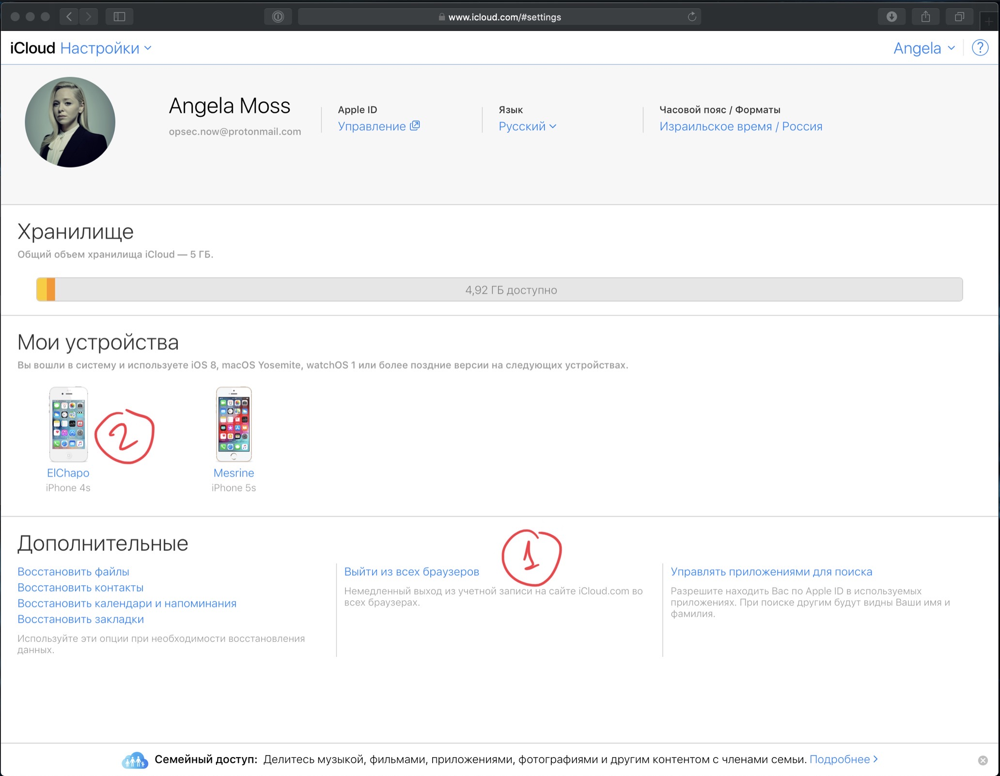
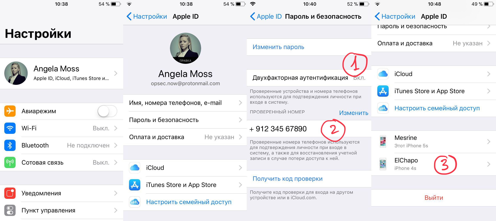
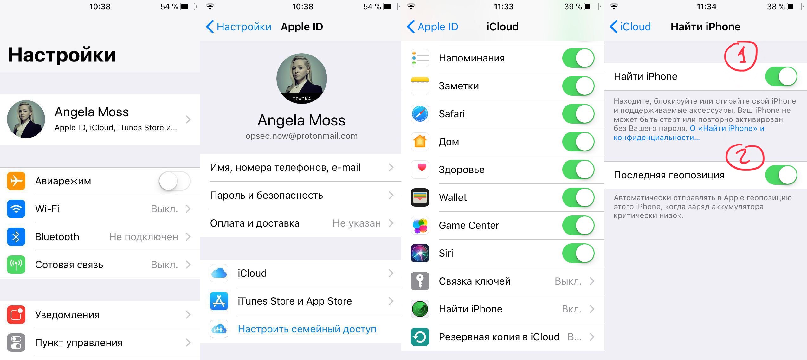
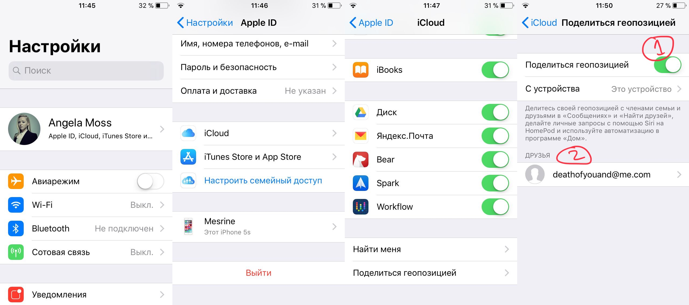
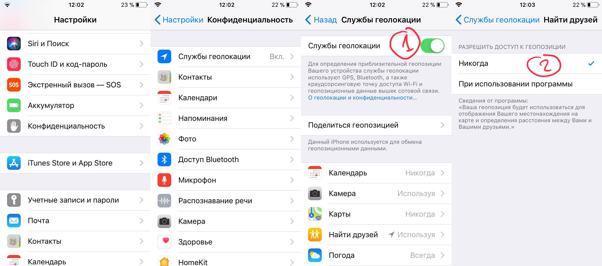
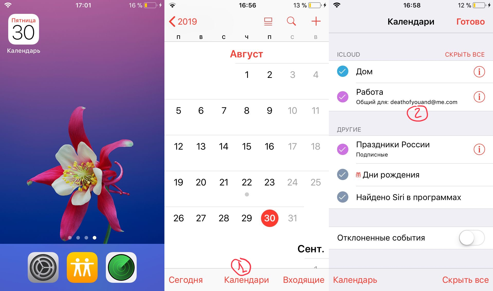
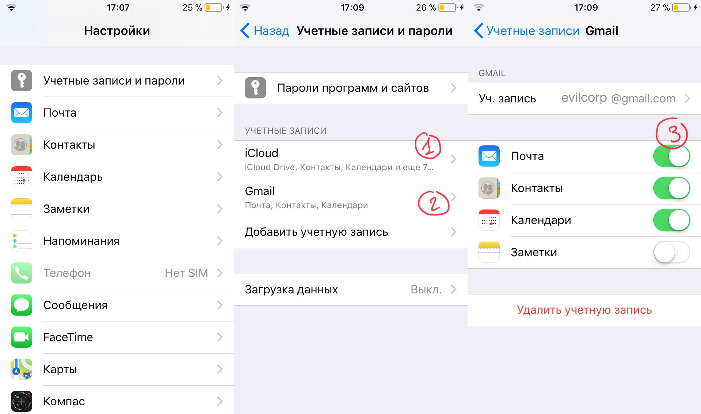
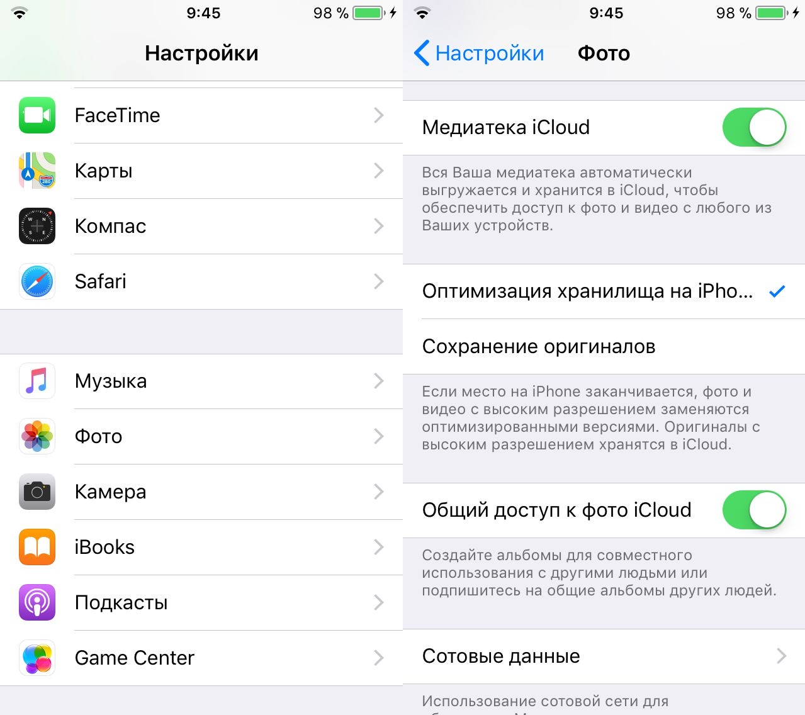
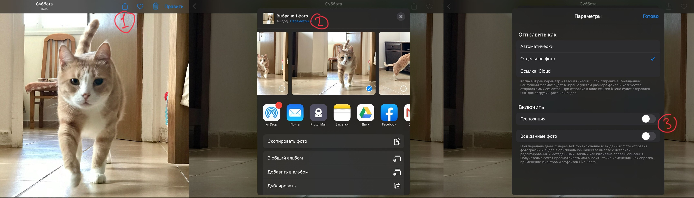
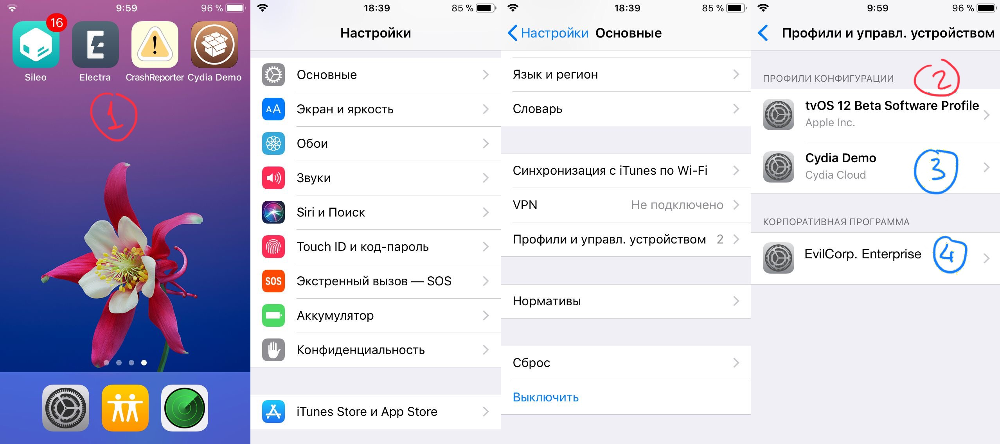

# Stalkerware

# Privacy — не абстракция

Всё чаще в новостях появляются сообщения о том, как государство и корпорации безнаказанно собирают наши личные данные. Всё более распространённым становится мнение, что конфиденциальность — базовое право человека, а специалисты твердят, что личные данные — золото 21 века. Это звучит настолько глобально и рисует настолько масштабную картину, что спрашиваешь себя: а лично меня как это касается? Корпорации и спецслужбы — это, конечно, глобальные угрозы обществу, но стоит ли о них беспокоиться лично мне?

Угроза лично тебе — люди, которые рядом. Родители, читающие переписку детей. Ревнивцы, желающие знать о контактах и перемещениях партнеров. Сталкеры, следящие за каждым твоим движением. Как и для спецслужб, самый ценный ресурс для них — твой смартфон; как и для корпораций, самая ценная добыча — твои аккаунты в соцсетях.

В этой статье мы расскажем, как злоумышленникам в сборе ваших данных помогают stalkerware — программы для слежки за человеком с помощью его смартфона. Цель stalkerware — собрать как можно больше личных данных конкретного человека: смс, чаты, телефонные и видеозвонки, история браузера, перемещения по GPS, введённые пароли, фотографии. Некоторые даже могут незаметно включать микрофон и камеру, блокировать входящие звонки и сообщения.

Следы таких программ были найдены на 82% смартфонов и компьютеров жертв домашнего насилия в США, на 74% — в Канаде, на 61% — в Австралии. Это большая индустрия, и типичному злоумышленнику совершенно не обязательно разбираться, как это технически устроено — за небольшую плату он получит готовую программу и простую инструкцию, как активировать слежку и где смотреть собранные данные. Некоторые компании даже предлагают новенькие смартфоны с предустановленным stalkerware в заводской упаковке, которые можно подарить жертве на день рождения.

 

Вот какие шаги можно предпринять, чтобы выявить слежку, и какие настройки смартфона и сервисов нужно проверить, чтобы свести риск к минимуму.

# iPhone и iPad

В отличии от Android, на iOS каждое приложение живет в отдельном контейнере и не видит данные других приложений. В большинстве случаев это мешает злоумышленнику просто установить на твой айфон или айпад stalkerware, которое доставало бы переписки из WhatsApp или Telegram и отправляло бы ему.

Поэтому StalkerWare на iOS работает по одной из трех схем:

1. Некоторые встроенные приложения разрешают другим приложениям видеть их данные с позволения пользователя — например, Фото или Контакты. С разрешения пользователя приложения также могут получать доступ к данным о перемещениях (Location Services), микрофону и камере. Для доступа к этим данным злоумышленник может установить stalkerware-софт на твой телефон (взяв его на пять минут), дать ему доступ ко всем сервисам и потом беспрепятственно получать информацию через сайт разработчика программы. Некоторые приложения вполне легально делятся местоположением пользователей друг с другом — Telegram, Google Maps или Find My Friend.
2. Многим разработчикам stalkerware этого недостаточно, и они используют обходные пути, чтобы ослабить системную защиту: через установку корпоративных сертификатов (изначально предназначенных для массового управления устройствами, выдаваемыми сотрудникам компаний) или используя уязвимости в коде операционной системы. Для установки такой программы или сертификата злоумышленнику тоже нужен физический доступ к разблокированному устройству.
3. Самый удобный путь для злоумышленника — когда физический доступ к устройству не нужен. Зная пароль, данные можно воровать из облака: iCloud хранит бэкапы, пароли, фотопотоки и закладки браузера. Бэкапы также могут сохраняться при физическом подключении к «доверенным компьютерам» с помощью iTunes, но технически задача злоумышленника та же — украсть файл бэкапа и достать из него личные данные.

В следующей части мы детально разберем каждую из этих схем по пунктам: 

*   **Как работает** — какая технология лежит в основе слежки.
*   **Что ворует** — какие данные утекают.
*   **Что нужно для активации** — какие шаги злоумышленник должен был предпринять, чтобы настроить слежку.
*   **Как поймать** — как узнать, что эти шаги были предприняты.
*   **Как защититься** — как отключить такую слежку.

## 1. Воровство без взлома

### iCloud
* **Как работает**: единый аккаунт всех сервисов Apple. Злоумышленник должен знать пароль от Apple ID.
* **Что ворует**: позволяет менять все настройки любых твоих устройств, читать почту, видеть календари, бэкапы, контакты, файлы, фотографии и проч. при условии, что их синхронизация включена.
* **Что нужно для активации**: знать пароль от Apple ID.
* **Как поймать**: никак.
* **Как защититься**:
  * завершить все текущие сессии в браузерах на сайте iCloud, проверить что нет лишних устройств: [https://www.icloud.com/#settings](https://www.icloud.com/#settings)

1. эта кнопка выкинет всех, кто в данный момент залогинен через браузер
2. эти устройства синхронизируются с твоим iCloud и могут менять его настройки, все ли они принадлежат тебе?
— поменять пароль iCloud, включить двухфакторную аутентификацию, проверить доверенные номера, проверить, что на странице профиля в списке устройств нет лишних:
_Настройки > твой профиль > Пароль и Безопасность > Двухфакторная аутентификация_ и _ПРОВЕРЕННЫЙ НОМЕР_

1. Двухфакторная аутентификация включена - хорошо
2. В этом списке только твои номера, к которым имеешь доступ только ты?
3. Все ли устройства из этого списка тебе знакомы?

### Найти iPhone (Find my iPhone)
* **Как работает**: встроенная функция поиска устройств Apple, предназначенная для определения местоположения украденных устройств, привязанных к Apple ID.
* **Что ворует**: real-time местонахождение устройства.
* **Что нужно для активации**: знать пароль от Apple ID, иметь одноразовый доступ к устройству.
* **Как поймать**: злоумышленник должен знать пароль от Apple ID и залогиниться с ним в программе Find my iPhone на другом устройстве Apple или на сайте.
* **Как защититься**:
  * защитить iCloud (см. выше);
  * если есть подозрения, что смены пароля iCloud недостаточно, можно отключить функцию в настройках iCloud: _Настройки > твой профиль > iCloud > Найти iPhone_.

1. Если эта опция включена, любой залогинившийся с твоим паролем в приложение _Найти iPhone_ на другом устройстве или на сайте будет видеть твое местоположение в реальном времени
2. Обе эти функции распространяются и на AirPods и на Apple Watch

### Найти Друзей (Find my Friend)
* **Как работает**: встроенная программа для определения местонахождения членов семьи и близких друзей, добавивших друг друга в список доверенных через Apple ID.
* **Что ворует**: real-time местонахождение одного из устройств, привязанных к твоему Apple ID.
* **Что нужно для активации**: знать пароль от Apple ID, иметь одноразовый доступ к устройству.
* **Как поймать**: злоумышленник должен внести свой Apple ID в список друзей или членов семьи в настройках твоего Apple ID.
* **Как защититься**: 
  * отключить функцию _Настройки > твой профиль > iCloud > Поделиться геопозицией._

1. Если эта опция включена, геопозиция будет отправляться без дополнительных уведомлений по запросу людей из списка 2 через приложение _Найти друзей_ (_Find my Friend_)
2. Всех ли людей здесь ты знаешь? Существует ли вероятность что их iCloud скомпрометирован?

### Локатор (Find my) на iOS 13
* **Как работает**: iOS 13 объединяет функции программ _Найти iPhone_ и _Найти Друзей_ в одном приложении. При этом нахождение устройств теперь возможно и их без подключения к интернету - они сообщают свое положение другим айфонам по неотключаемому Bluetooth каналу. С одной стороны, это мешает похителям помешать обнаружению устройства, но с другой стороны возрастает важность обезопасть свой iCloud.
* **Как защититься**: защитить iCloud (см. выше);

### Геолокация
* **Как работает**: любые приложения из App Store, имеющие доступ к геоданным, могут сливать их. Приложения могут быть и не предназначены для слежки — например, Swarm, отмечающий историю перемещений в фоновом режиме, или Google Maps с функцией Location Sharing.
* **Что ворует**: real-time местонахождение устройства (при этом видно синюю плашку вверху экрана), историю перемещений (незаметно).
* **Что нужно для активации**: установить программу и иметь одноразовый доступ к устройству.
* **Как поймать**: все приложения, запросившие доступ к геоданным, видно в одном списке _Настройки > Конфиденциальность > Службы геолокации_.
* **Как защититься**: 
  * отключить доступ к геолокации совсем
  * либо проверить каждую строку в списке. Если нет уверенности, что приложению действительно нужны данные о геопозиции, — поставить Never, если нужны, когда приложение открыто, — поставить While Using the App, оставить Always у абсолютного минимума приложений, которые необходимы и которым доверяешь.

1. эта опция быстро отключает доступ к геопозиции для всех приложений
2. опция _Всегда_ должна быть лишь у абсолютного минимума программ, которым ты точно доверяешь и знаешь что у них нет спрятанной функции передачи геопозиции

### Контакты и Заметки
* **Как работает**: 
  * любые приложения из App Store, имеющие доступ к контактам, могут сливать их;
  * контакты и заметки могут автоматически синхронизироваться с сервисами электронной почты.
* **Что ворует**: карточки контактов из приложений _Контакты_ и _Телефон_, заметки из приложения Заметки
* **Что нужно для активации**: иметь одноразовый доступ к устройству.
* **Как поймать**: 
  * все приложения, запросившие доступ к контактам, видно в одном списке в _Настройки > Конфиденциальность > Контакты_;
  * все сервисы почты, синхронизируемые с устройством, видно в _Настройки > Учетные записи и пароли_.
* **Как защититься**: 
  * проверить каждую строку в списке _Настройки > Конфиденциальность > Контакты_ и оставить доступ у абсолютного минимума приложений, которые необходимы и которым доверяешь;
  * зайти в каждый аккаунт в _Настройки > Учетные записи и пароли_ и проверить, нужна ли тебе синхронизация с ним.

1. одна учетная запись iCloud будет всегда, она ведет на экран настроек, который мы видели в _Настройки > твой профиль > iCloud_
2. а чей это почтовый сервис?
3. нужна ли для него синхронизация всех этих данных? Если ли вероятность что он скомпрометирован?

### Календари
* **Как работает**: 
  * любые приложения из App Store, имеющие доступ к календарю, могут сливать, добавлять или изменять события;
  * календарь может автоматически синхронизироваться с сервисами электронной почты;
  * календарь может быть общим с другими пользователями сервисов Apple.
* **Что ворует**: события из приложения _Календарь_.
* **Что нужно для активации**: иметь одноразовый доступ к устройству.
* **Как поймать**: 
  * все приложения, запросившие доступ к контактам, видно в одном списке в _Настройки > Конфиденциальность > Календарь_;
  * все сервисы почты, синхронизируемые с устройством, видно в _Настройки > Учетные записи и пароли_;
  * общие календари видно в _Календарь_ > _Календари_ отмеченными как _Общий для_.
* **Как защититься**: 
  * проверить каждую строку в списке _Настройки > Конфиденциальность > Календарь_ и оставить доступ у абсолютного минимума приложений, которые необходимы и которым доверяешь;
  * зайти в каждый аккаунт в _Настройки > Учетные записи и пароли_ и отключить синхронизацию календарей с ним;
  * удалить общие календари из приложения _Календарь_ или очистить список людей, с которыми этот календарь общий.

1. настройки скрываются за этой кнопкой
2. на этом скриншоте календарь Работа синхронизируется с другим пользователем сервисов Apple - можно ли доверять ему? Если ли вероятность что его iCloud скомпрометирован?

### Медиатека iCloud
* **Как работает**: встроенные функции приложения _Фото_ и iCloud для синхронизации фотографий между устройствами.
* **Что ворует**: фотографии из фотопотока.
* **Что нужно для активации**: иметь одноразовый доступ к устройству либо доступ к iCloud.
* **Как поймать**: проверить настройки на экране Настройки > Фото.
* **Как защититься**: 
  * защитить iCloud (см. выше);
  * если есть вероятность, что iCloud все еще скомпрометирован, отключить пункт _Медиатека iCloud_, что предотвратит автоматическую выгрузку фотографий в iCloud и синхронизацию между всеми устройствами, на которых выполнен вход в этот Apple ID;
  * если есть вероятность, что iCloud все еще скомпрометирован, отключить пункт _Загружать в фотопоток_ (если он есть), что предотвратит аналогичную выгрузку последних 30 фото;
  * отключить пункт _Общий доступ к фото iCloud_ (если он есть), что предотвратит загрузку фотографий в альбомы, общие с другими пользователями сервисов Apple (эти альбомы видны в приложении _Фото > Альбомы > Общие альбомы_);

### Метадата фотографий
* **Как работает**: большинство фотографий, сделанных современными камерами, содержат служебную информацию, которую можно посмотреть через специальные приложения. Так, например, приложение _Фото_ показывает все фото на карте.
* **Что ворует**: характеристики камеры, дата и время, GPS координаты места, где была сделана фотография. Эти данные называются Exif или Metadata.
* **Что нужно для активации**: по умолчанию приложение _Фото_ делится этой информацией с приложениями, которым ты передаешь из него фотографии. Хотя большинство соцсетей отрезают эти характеристики при загрузке, некоторые этого не делают и могут выдать информацию о тебе.
* **Как поймать**: быть бдительнее
* **Как защититься**: 
    * в AppStore есть множество программ, которые позволяют просматривать и исключать из файлов метаданные - их легко найти по слову "Exif".
    * iOS 13 позволяет исключить Exif из фото до того, как ты им поделишься. На обновленном экране _Поделиться_ есть незаметный пункт _Параметры_, внутри которого для максимальной безопасности оба переключателя должны быть выключены;

## 2. Отключение защиты iOS
### Jailbreak
* **Как работает**: на устройство устанавливается специальная программа, которая провоцирует небольшой системный сбой, из-за которого отключаются некоторые ограничения. Без этих ограничений все приложения могут вылезать за пределы своей «песочницы», подглядывать за данными других приложений и делать с ними что угодно, в том числе подменять или отправлять злоумышленникам. После перезагрузки телефона система возвращается к первоначальному состоянию, и сбой нужно провоцировать снова.
* **Что ворует**: абсолютно все данные, кроме особо защищенных приложений (Signal, 1Password, ProtonMail), разработчики которых предусмотрели такую опасность. Telegram — не среди них.
* **Что нужно для активации**: иметь одноразовый доступ к устройству после каждой перезагрузки, версия iOS должна иметь уязвимость.
* **Как обнаружить**: 
  * Чтобы спровоцировать сбой, должна быть установлена программа-джейлбрейкер, подходящая твоей версии iOS: Chimera и unc0ver на iOS 12, Electra и Yalu на iOS 11, и десяток других для более старых версий. Программа будет видна, хотя умелый злоумышленник может изменить её название.
  * Такие программы не попадают в App Store, поэтому злоумышленнику придется установить её вручную. В некоторых случаях это оставит след в _Настройки > Основные > Профили и управл. устройством_, где будет установлен профиль разработчика приложения, но в некоторых случаях это не обязательно.
  * В большинстве случаев программа-джейлбрейкер установит отдельную программу-магазин приложений (аналог App Store), которая может называться Sileo или Cydia. Через неё злоумышленник будет устанавливать невидимые шпионские программы, но сама она будет видна.
* **Как защититься**: Уязвимости, позволяющие провоцировать сбой, закрываются обновлениями iOS, поэтому единственная надёжная защита — установить самое последнее обновление через _Настройки > Основные > Обновление ПО_. Обновления будут скачиваться и устанавливаться автоматически, если включена опция _Автообновление_. Более старые устройства могут не иметь обновлений (iOS 13 недоступна для iPhone 6/iPhone 6+/iPhone SE и старее, iOS 12 недоступна для iPhone 5 и старее), но это не значит что они безопасны.
  * Злоумышленник может помешать твоему телефону увидеть обновление, установив профиль разработчика с именем `_tvOS 12 Beta Software Profile_` или `_tvOS 11 Beta Software Profile_` в _Настройки > Основные > Профили и управл. устройством_;
  * Также помешать узнать о выходе обновления может одна из невидимых программ, установленных после джейлбрейка. Чтобы исключить этот случай, перезагрузи телефон и подключи к iTunes, чтобы компьютер сверился с серверами Apple, на которых хранятся обновления.

1. Некоторые из программ-джейлбрейкеров (unc0ver, Chimera, Electra, Yalu, H3lix, Phoënix) и сопутствующих программ-магазинов приложений (Sileo, Cydia). Первые провоцируют системный сбой, ослабляющий защиту. Вторые невозможно удалить как все остальные программы, но они не открываются, пока защита не ослаблена;
2. Профиль конфигурации, мешающий телефону видеть обновления операционной системы, в которых содержатся исправления уязвимостей;
3. Профиль конфигурации (см. далее)
4. Корпоративная программа  (см. далее)

### Профили конфигурации и Корпоративные программы
* **Как работает**: задуманные как средство управления устройствами, выданными работодателем на производстве, профили конфигурации и корпоративные программы дают огромную власть над устройством специально настроенному серверу.
* **Что ворует**: местоположение устройства, звонки, трафик — почти всё что угодно.
* **Что нужно для активации**: иметь одноразовый доступ к устройству.
* **Как поймать**: злоумышленник должен установить профиль конфигурации или сертификат корпоративной программы в настройках iPhone.
* **Как защититься**:
  * в списке _Настройки > Основные > Профили и управл. устройством_ не должно быть ничего;
  * в списке _Настройки > Основные > Об этом устройстве > Доверие сертификатов_ не должно быть никаких переключателей (только _Версия хранилища_ с номером).

## 3. Backup
* **Как работает**: Бэкапы включают в себя все настройки устройства и все данные всех программ на нём. Они создаются автоматически и могут быть сохранены в облако iCloud, либо на доверенные компьютеры при подключении к ним по USB или WiFi.
* **Что ворует**: всё что угодно. 
* **Что нужно для активации**:
  * знать пароль Apple ID, чтобы зайти с другого устройства на сайт iCloud и скачать бэкап;
  * иметь доступ к доверенному компьютеру (для добавления компьютера в доверенные — подключиться к нему по USB и ввести пароль разблокировки айфона).
* **Как поймать**: никак.
* **Как защититься**:
  * защитить iCloud (см. выше);
  * если нет 100% уверенности, что Apple ID не взломан, отключить сохранение бэкапов в iCloud через _Настройки > твой профиль > iCloud > Резервная копия в iCloud_;
  * не подключать телефон кабелем к другим устройствам, очистить список доверенных компьютеров, обнулив настройки _Конфиденциальности_ до заводских: _Настройки > Основные > Сброс > Сбросить геонастройки_. Теперь при первом подключении к устройству, которое может запрашивать бэкапы, появится алерт.
